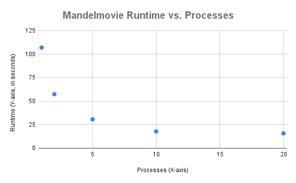

# System Programming Lab 11 Multiprocessing

* **Name:** Lincoln Jiang
* **Repo:** https://github.com/MSOE-CPE2600/multiprocessing-turney-LincolnBWJ.git
* **Branch:** labWeek11dev

### Part 1: Implementation Overview

To make the movie, I wrote a new program called `mandelmovie.c`.

* This program uses `getopt` to read the `-n` number from the command line.
* It uses a `while` loop to run `fork()` `TOTAL_FRAMES` (50) times.
* The child process uses `execv` to run the `./mandel` program with the correct zoom settings for each frame.
* The parent process uses `wait()` to make sure that no more than `-n` children are running at the same time.
* I also updated the `Makefile` to build `mandelmovie` along with the original `mandel` program.

### Part 2: Runtime Graph

This graph shows the time it took to make 50 frames with different `-n` values.

*(Data collected using the `time` command for 1, 2, 5, 10, and 20 processes)*

### Part 3: Results Discussion

The results from the graph are clear.

* Using more processes makes the program much faster. Going from 1 process (106.88s) to 10 processes (17.78s) saved a lot of time.
* But, the speed increase stopped after 10 processes. The time for 10 processes (17.78s) is almost the same as 20 processes (15.77s).
* **Conclusion**: Using more processes helps, but only up to a point. After about 10 processes, it doesn't get much faster. This is probably because my computer ran out of CPU cores to use.